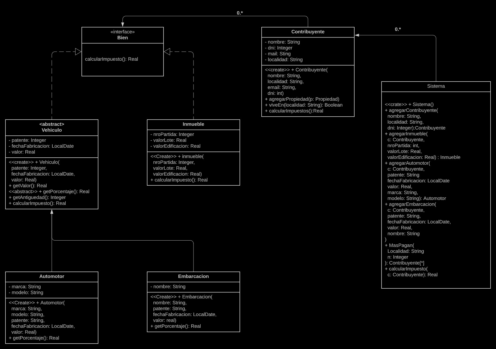

## `Parcial Primera Fecha`

Nos contratan de la agencia de recaudación de la provincia de Buenos Aires para hacer un sistema para el cálculo del impuesto que deben pagar los contribuyentes.

El sistoma ofrece la siguiente funcionalidad:

- **Dar de alta un contibuyente**: Se provee nombre, dni, email y localidad. El sistema da de alta al contribuyente y lo retorna. El contribuyente no tiene ningún bien a su nombre.
- **Dar do alta un Inmueble**: Se provee el número de partida, el valor del lote, el valor de la edificación, y el contribuyente (propietario). El sistema da de alta el inmueble y lo retorna.
- **Dar de alta un automotor:** Se provee patente, marca, modelo, fecha de fabricación, valor y el contribuyente (propietario). El sistema da de alta al automotor y lo retorna.
- **Dar de alta una embarcación:** se provee patente, nombre, fecha de fabricación, valor y el contribuyente
(propietario). El sistema da de alta la embarcación y la retorna.
- **Calcular el impuesto que debe pagar un contribuyente:** dado un contribuyente, se debe calcular cuánto debe pagar de impuestos, según la siguiente especificación:
  - Por cada inmueble que posea, el contribuyente debe pagar un 1% del valor del mismo, que se calcula sumando el valor del lote y el valor de la edificación.
  - Por cada uno de los otros bienes, se debe pagar un porcentaje del valor de los mismos, en función de su fecha de fabricación.
  -  Encaso de **superar los 10 años**, no deben pagar nada.
  - En caso contrario, el porcentaje para un automotor es el **5%** mientras que para una embarcación ese porcentaje varía según el valor de la misma. Si éste es menor a **1 millón**, es el **10%**, caso contrario, el **15%**.
- **Contribuyentes que más pagan de una localidad**: Dada una localidad y un número N, se debe retornar los N contribuyentes de la localidad recibida que más deben pagar por sus bienes.

Su tarea es diseñar y programar en Java lo que sea necesario para ofrecer la funcionalidad antes descrita. Se espera que entregue lo siguiente:

- Diseño de su solución en un diagrama de clases UML.
- Implementación en Java de la funcionalidad requerida.
- Implemente los tests necesarios para **la funcionalidad de calcular el impuesto**, justificando su elección en base a valores de borde y particiones equivalentes. Considere contribuyentes que solamente pueden ser embarcaciones.


### Notas
- Para calcular los años entre dos fechas puede utilizar la siguiente expresión
  ```java
  ChronoUnit.YEARS.between(fechat, fecha2);
  ```
-   Donde la fecha1 es anterior a fecha2. La expresión retorna la cantidad de años entre ambas fechas.
- Implemente todos los constructores que considere necesarios
- Puede implementar un getter y un setter, y asumir a existencia del resto.

--- 

## Links utiles

- [UML](https://lucid.app/lucidchart/bd9ff479-d0f1-4a4f-807a-d6546f59684f/edit?beaconFlowId=7DFA4BB45E07B703&invitationId=inv_04cac74f-82c1-4290-be16-967a3da3d4d3&page=HWEp-vi-RSFO#)

### Uml (Click derecho y abrir en la web para el zoom)




## Objetos

- [Sistema](#sistema)
- [Contribuyente](#contribuyente)
- [Propiedad \<interface>](#propiedad)
- [Vehiculo \<abstract>](#vehiculo)
- [Embarcacion](#embarcacion)
- [Automotor](#automotor)
- [Inmueble](#inmueble)

---

<br>

### Sistema

```java
public class Sistema(){
  private List<Contribuyente> contribuyentes;

  public Sistema(){
    this.contribuyentes = new ArrayList();
  }

  public Contribuyente agregarContribuyente(String nombre, String localidad, String email, int dni){
    Contribuyente nuevo = new Contribuyentes(nombre, localidad, email, dni);
    contribuyentes.add(nuevo);
    return nuevo;
  }

  public Inmueble agregarInmueble(Contribuyente c, int nroPartida, double valorLote, double valorEdificacion){
    Inmueble nuevo = new Inmueble(nroPartida, valorLote, valorEdificacion);
    c.agregarPropiedad(nuevo);
    return nuevo;
  }

  public Automotor agregarAutomotor(Contribuyente c, String patente, LocalDate fechaFabricacion, double valor, String marca, String modelo){
    Automotor nuevo = nuevo new Automotor(patente, fechaFabricacion, valor, marca, modelo);
    c.agregarPropiedad(nuevo);
    return nuevo;
  }

  public Embarcacion agregarEmbarcacion(Contribuyente c, String patente, LocalDate fechaFabricacion, double valor, String nombre){
    Embarcacion nuevo = new Embarcacion(patente, fechaFabricacion, valor, nombre);
    c.agregarPropiedad(nuevo);
    return nuevo;
  }

  public List<Contribuyente> masPagan (String localidad, int N){
    return contribuyentes.stream().
      filter(c->c.viveEn(localidad))
      .sorted((ex1, ex2) -> Double.compare(ex2.calcularImpuesto(), ex1.calcularImpuestos()))
      .limit(N)
      .collect(Collectors.toList());
    //Se ordena de mayor a menor
  }

  public double calcularImpuesto(Contribuyente c){
    return c.calcularImpuesto();
  }

}
```

<br>

### Contribuyente

```java
public class Contribuyente{
  private String nombre, localidad, mail;
  private int dni;
  private List<Propiedad> propiedades;

  public Contribuyente(String nombre, String localidad, String email, int dni){
    this.nombre = nombre;
    this.localidad = localidad;
    this.email = email;
    this.dni = dni;
    this.propiedades = new ArrayList<>();
  }

  public void agregarPropiedad(Propiedad p){
    propiedades.add(p);
  }

  public boolean viveEn(String localidad){
    return this.localidad.equals(localidad);
  }

  public double calcularImpuestos(){
    return propiedades.stream()
      .mapToDouble(p->p.calcularImpuesto()).sum();
  }
}
```

<br>

### Propiedad

```java
public interface Propiedad{
  double calcularImpuesto();
}
```

<br>

### Vehiculo

```java
public abstract class Vehiculo implements Propiedad{
  private String patente;
  private LocalDate fechaFabricacion;
  private double valor;
  
  public Vehiculo(String patente, LocalDate fechaFabricacion, double valor){
    this.patente = patente;
    this.fechaFabricacion = fechaFabricacion;
    this.valor = valor;
  }

  public double getValor(){
    return valor;
  }

  abstract public double getPorcentaje();

  public int getAntiguedad(){
    return (int) ChronoUnit.YEARS.between(fechaFabricaciom, LocalDate.now());
  }
  
  public double calcularImpuesto(){
    if (getAntiguedad() > 10){
      return 0;
    }
    return getPorcentaje() * valor;
  }
}
```

<br>

### Embarcacion

```java
public class Embarcacion extends Vehiculo{
  private String nombre;

  public Embarcacion(String patente, LocalDate fechaFabricacion, double valor, String nombre){
    super(patente, fechaFabricacion, valor);
    this.nombre = nombre;
  }

  public double getPorcentaje(){
    if (this.getValor() < 1000000){
      return 0.1;
    }
    return 0.15;
  }
}
```

<br>

### Automotor

```java
public class Automotor extends Vehiculo(){
  private String marca, modelo;

  public Automotor(String patente, LocalDate fechaFabricaciom, double valor, String marca, String modelo){
    super(patente, fechaFabricacion, valor);
    this.marca = marca;
    this.modelo = modelo;
  }

  public double getPorcentaje(){
    return 0.5;
  }
}
```

<br>

### Inmueble

```java
public class Inmueble implements Propiedad{
  private int nroPartida;
  private double valorLote, valorEdificacion;

  public Inmueble(int nroPartida, double valorLote, double, valorEdificacion){
    this.nroPartida = nroPartida;
    this.valorEdificacion = valorEdificacion;
    this.valorLote = valorLote;
  }

  public double calcularImpuesto(){
    return (this.valorLote + this.valorEdificacion) * 0.01;
  }
}
```


## `Parcial Segunda Fecha`

MyCarBoxes es una empresa que vernde repuestos y ofrece servicios de reparación a vehiculos. El sistema registra órdenes de compra de repuestos y órdenes de reparación. Las reparaciones son llevadas a cabo por personal de MyCarBoxes, quienes cobran por hora sus tareas de reparación. Cada empleado puede cobrar un valor por hora distinto.
Implemente la siguiente funcionalidad:

- **Dar de alta un repuesto:** Se provee el nombre, fecha de fabricación y costo. El sistema registra el repuesto y lo retorna.
- **Dar de alta un empleado:** Se provee el nombre completo y el valor por hora. El sistema registra el empleado y lo retorna.
- **Registrar una orden de compra de Repuestos:** Se provee la patente del vehiculo y la lista de repuestos. El sistema registra la orden con la fecha actual